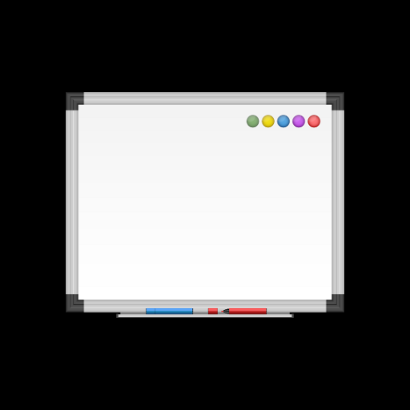

# Infiniboard v1

Infiniboard v1 is a real-time collaborative infinite whiteboard web application built with Node.js, Express, and Socket.IO. It allows multiple users to draw together on an infinitely expandable canvas, offering a seamless and interactive experience for brainstorming, teaching, or any collaborative visual work.



## Features

- Real-time collaboration: Multiple users can draw simultaneously
- Infinite canvas: Pan and zoom to explore an expansive drawing area
- Rich drawing tools:
  - Pen and eraser tools
  - Customizable brush size and shape
  - Color picker with preset swatches
  - Gradient tool for creating smooth color transitions
- User presence: See other users' cursors and usernames in real-time
- Responsive design: Works on desktop and mobile devices

## Live Demo

Experience Infiniboard v1 in action: [https://infiniboard.mohdmahmodi.com/](https://infiniboard.mohdmahmodi.com/)

## Prerequisites

- Node.js (v12.0.0 or higher)
- npm (v6.0.0 or higher)

## Installation

1. Clone the repository:
   ```
   git clone https://github.com/MohdYahyaMahmodi/infiniboard.git
   cd infiniboard
   ```

2. Install dependencies:
   ```
   npm install
   ```

3. Start the server:
   ```
   node server.js
   ```

4. Open your browser and navigate to `http://localhost:3010`

## Project Structure

```
infiniboard-v1/
│
├── public/
│   ├── index.html
│   ├── styles.css
│   └── script.js
│
├── server.js
├── package.json
└── README.md
```

## Technical Overview

### Backend (server.js)

The backend is built with Node.js and Express, using Socket.IO for real-time communication.

Key components:

- Express server setup
- Socket.IO event handling
- User management (connection, disconnection, user info)
- Broadcasting drawing and cursor data

### Frontend (index.html, script.js)

The frontend is built with vanilla JavaScript and HTML5 Canvas.

Key components:

- Canvas setup and drawing functions
- User interface for drawing tools
- Socket.IO client for real-time updates
- Infinite canvas implementation (panning and zooming)
- Cursor tracking and display

### Real-time Communication

Socket.IO is used for bidirectional, event-based communication between the server and clients. Key events include:

- `'connection'`: New user connects
- `'set user'`: Set user information (username, userId)
- `'drawing'`: Broadcast drawing data
- `'cursor move'`: Broadcast cursor position
- `'disconnect'`: User disconnects

### Infinite Canvas

The infinite canvas is implemented using a panning mechanism:

- Track mouse/touch movements for panning
- Adjust drawing coordinates based on pan offset
- Dynamically expand canvas size as users draw near edges

### Drawing Tools

Various drawing tools are implemented:

- Pen and eraser tools
- Customizable brush size and shape
- Color picker with preset swatches
- Gradient tool for smooth color transitions

### User Presence

Real-time user presence is shown through:

- Displaying other users' cursors
- Showing usernames next to cursors

## Security Considerations

- User input sanitization to prevent XSS attacks
- Use of UUID for user identification
- HTTPS recommended for production deployment

## Future Improvements

- Add ability to save and load drawings
- Implement undo/redo functionality
- Add more drawing tools (shapes, text, etc.)
- Optimize performance for very large drawings
- Implement user authentication and persistent rooms

## Contributing

Contributions are welcome! Please feel free to submit a Pull Request.

## About the Author

Infiniboard v1 is created and maintained by Mohd Mahmodi.

- Website: [MohdMahmodi.com](https://MohdMahmodi.com)
- Twitter: [@mohdmahmodi](https://twitter.com/mohdmahmodi)

## License

This project is open source and available under the [MIT License](LICENSE).